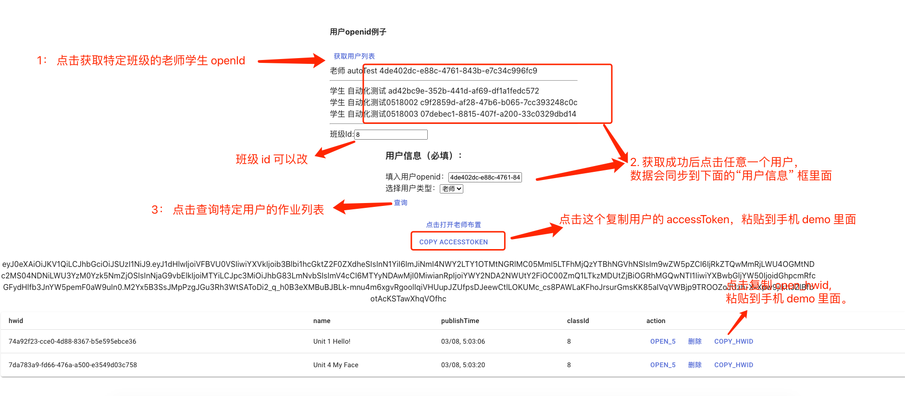
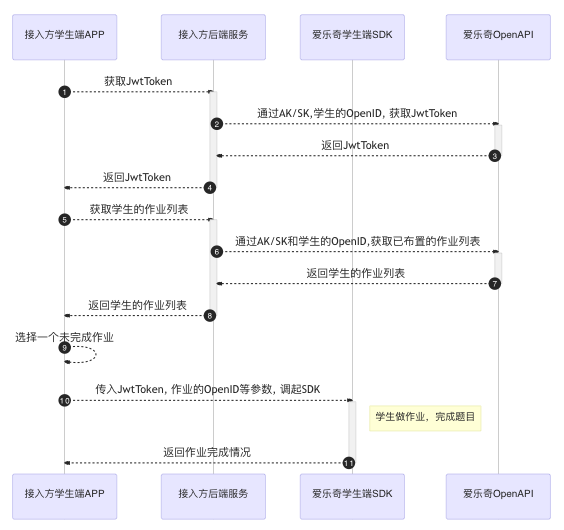

这个 demo 用来演示如何根据 app_id + app_secrect 获取用户的 accessToken 以及 open_hwid

首先在根目录创建一个.env 文件,然后粘贴如下信息:


```
STUDENT_API=https://student-api.alo7.com
TEACHER_API=https://teacher-api.alo7.com
GATE_WAY_API=https://api.alo7.com
APP_ID=替换成你自己的
APP_SECRET=替换成你自己的

```

## Getting Started

First, run the development server:

```bash
npm run dev
# or
yarn dev
```

Open [http://localhost:3000](http://localhost:3000) with your browser to see the result.




You can start editing the page by modifying `pages/index.js`. The page auto-updates as you edit the file.

[API routes](https://nextjs.org/docs/api-routes/introduction) can be accessed on [http://localhost:3000/api/hello](http://localhost:3000/api/hello). This endpoint can be edited in `pages/api/hello.js`.

The `pages/api` directory is mapped to `/api/*`. Files in this directory are treated as [API routes](https://nextjs.org/docs/api-routes/introduction) instead of React pages.

## Learn More

To learn more about Next.js, take a look at the following resources:

- [Next.js Documentation](https://nextjs.org/docs) - learn about Next.js features and API.
- [Learn Next.js](https://nextjs.org/learn) - an interactive Next.js tutorial.

You can check out [the Next.js GitHub repository](https://github.com/vercel/next.js/) - your feedback and contributions are welcome!

## Docker

You can build your container with `npm run docker:build` and run it with `npm run docker:start`.


## 调用时序图


[文档地址](https://git.saybot.net/aot-java/alo7-open-api-doc/-/tree/master/%E7%88%B1%E4%B9%90%E5%A5%87%E4%BD%9C%E4%B8%9A%E7%AC%AC%E4%B8%89%E6%96%B9%E6%8E%A5%E5%85%A5)




### 接口调用情况

```
STUDENT_API=https://student-api.alo7.com
TEACHER_API=https://teacher-api.alo7.com
GATE_WAY_API=https://api.alo7.com
```

主流程: 


| 说明 | url schema  | open api 文档 |
| --- | --- | --- |
| 1.根据 ak sk 获取 token | ${process.env.GATE_WAY_API}/system/token  | https://web-s3.alo7.com/public/open-api-doc/openapi.html#%E8%8E%B7%E5%8F%96_token |
| 2.根据 token 和 openId 获取 accessToken | ${process.env.GATE_WAY_API}/account/api/v2/${role}/organization/accessToken  | https://web-s3.alo7.com/public/open-api-doc/openapi.html#%E7%94%B3%E8%AF%B7%E5%AD%A6%E7%94%9F%E8%AE%BF%E9%97%AEtoken |
| 3.获取作业列表 | ${process.env.GATE_WAY_API}/study-center/api/v4/homework/${role}/${openId}  | https://web-s3.alo7.com/public/open-api-doc/openapi.html#%E6%9F%A5%E8%AF%A2%E5%AD%A6%E7%94%9F%E7%9A%84%E4%BD%9C%E4%B8%9A%E5%88%97%E8%A1%A8  https://web-s3.alo7.com/public/open-api-doc/openapi.html#%E6%9F%A5%E8%AF%A2%E8%80%81%E5%B8%88%E7%9A%84%E4%BD%9C%E4%B8%9A%E5%88%97%E8%A1%A8 |
| 4.获取老师布置作业 url | ${process.env.TEACHER_API}/api/v1/h5url/homeworks/assignment  | sdk 内部使用 |
| 5.获取老师查看班级的作业url | ${process.env.TEACHER_API}/api/v1/h5url/homeworks/${uuid}/whole_result  | sdk 内部使用 |
| 5.获取学生查看&练习作业url | ${process.env.STUDENT_API}/api/v2/homeworks/${uuid}/homework_h5url  | sdk 内部使用 |
| 6.删除作业 | ${process.env.GATE_WAY_API}/study-center/api/v4/homework/${homeworkId}  | https://web-s3.alo7.com/public/open-api-doc/openapi.html#%E5%88%A0%E9%99%A4%E4%BD%9C%E4%B8%9A |
| 测试用:获取班级内的老师列表 | ${process.env.GATE_WAY_API}/study-center/api/v5/thirdPartyClazz/${classId}/teachers  | https://web-s3.alo7.com/public/open-api-doc/openapi.html#%E6%9F%A5%E8%AF%A2%E7%8F%AD%E7%BA%A7%E8%80%81%E5%B8%88 |
| 测试用:获取班级内的学生列表 | ${process.env.GATE_WAY_API}/study-center/api/v5/thirdPartyClazz/${classId}/students  | https://web-s3.alo7.com/public/open-api-doc/openapi.html#%E6%9F%A5%E8%AF%A2%E7%8F%AD%E7%BA%A7%E5%AD%A6%E7%94%9F |


